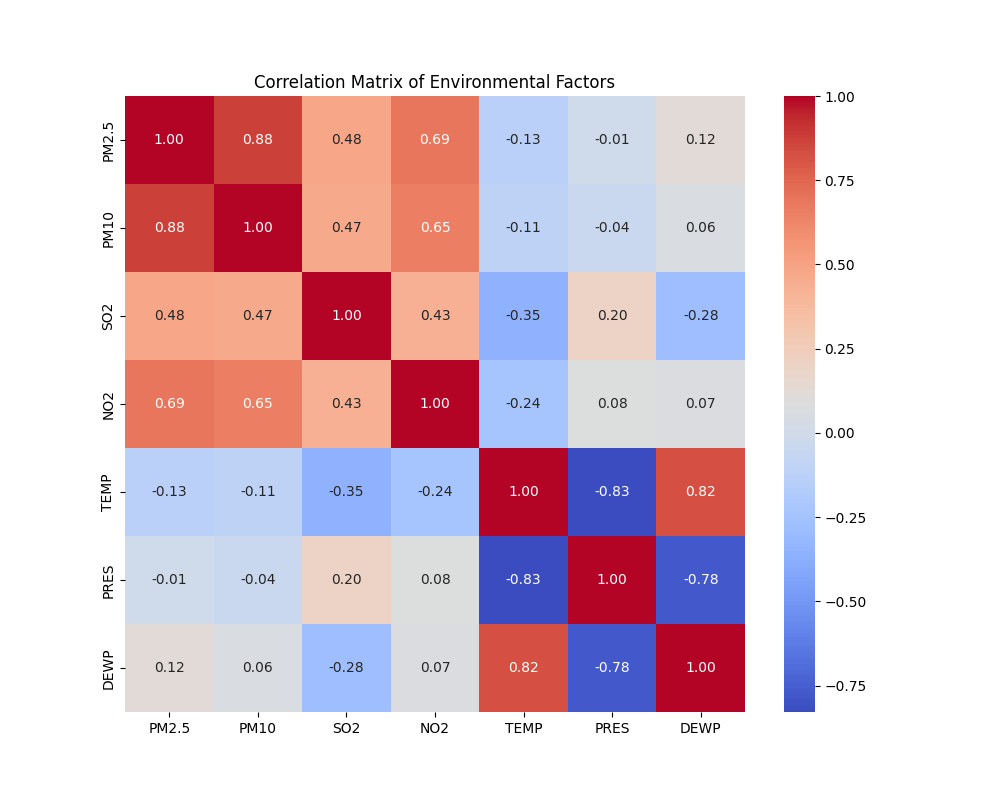
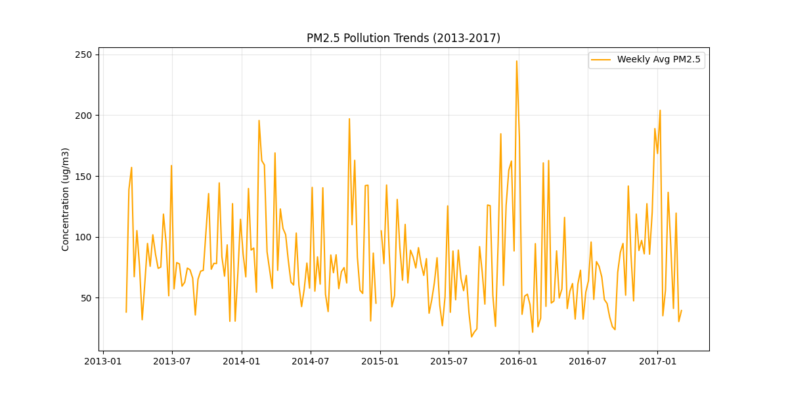

# EcoStream: Industrial Sensor Anomaly Detection Pipeline

  

## Project Overview
Modeled after production workflows experienced at **Zhilan Ecological Technology**, EcoStream is an end-to-end data pipeline designed to ingest environmental telemetry and detect sensor anomalies in real-time.

Using the **Beijing Multi-Site Air Quality dataset**, this project simulates a scenario where IoT sensors monitor critical air pollutants. The system ingests raw logs into a SQL data lake, performs cleaning, and deploys an **Isolation Forest** machine learning model to flag equipment malfunctions or extreme environmental events.

## Key Features
* **ETL Pipeline:** Automated ingestion of raw CSV telemetry into a structured SQLite database using Pandas.
* **Unsupervised Learning:** Implemented `IsolationForest` (Scikit-Learn) to detect multivariate anomalies without labeled data, mimicking real-world "cold start" monitoring scenarios.
* **Reproducibility:** Fully containerized environment using Docker to ensure consistent execution across platforms.

## Data Analysis
We identified strong correlations between PM2.5 and PM10, as well as distinct seasonal pollution spikes consistent with winter heating cycles.


*(Figure 1: Feature Correlation Matrix showing sensor dependencies)*


*(Figure 2: PM2.5 Concentration trends over 4 years)*

## How to Run
**Using Docker (Recommended):**
```bash
docker build -t ecostream .
docker run ecostream
```

## Notebook Demo (Admissions-Friendly)

For reviewers who prefer an interactive walkthrough, see `notebooks/pipeline_demo.ipynb`, which demonstrates:

- End-to-end ingestion and preprocessing
- Isolation Forest anomaly detection
- Diagnostic visualizations
- Clean, readable outputs suitable for review

This notebook mirrors the production pipeline logic in a self-contained format.

## Project Structure
```text
/EcoStream
│
├── data/                  # Contains raw CSV and processed SQLite database
├── notebooks/
│   ├── pipeline_demo.ipynb # **START HERE**: End-to-end modular pipeline walkthrough
│   └── analysis.ipynb      # Initial EDA and visualization experiments
├── src/
│   ├── ingest.py          # ETL script: CSV -> SQL
│   └── model.py           # ML script: Train Isolation Forest
├── Dockerfile             # Container configuration
└── requirements.txt       # Python dependencies