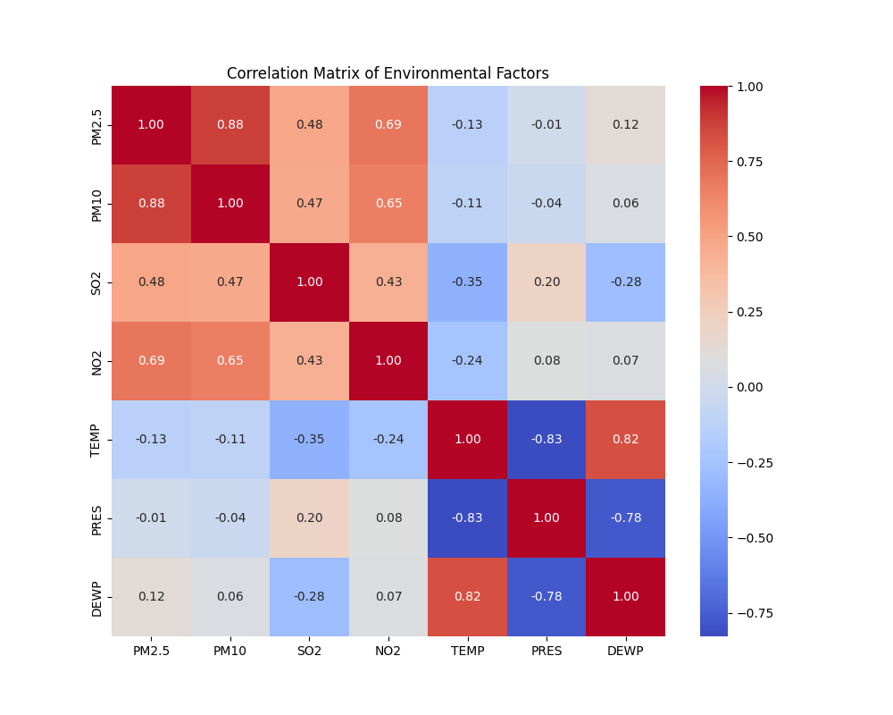
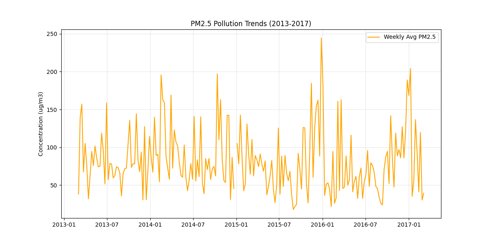

# EcoStream: Industrial Sensor Anomaly Detection Pipeline

  

## Project Overview
**Data Source:** [Beijing Multi-Site Air Quality Data (UCI Repository)](https://archive.ics.uci.edu/dataset/501/beijing+multi+site+air+quality+data)

Inspired by the **high-reliability data pipelines** developed at **Zhilan Ecological Technology**, EcoStream is an end-to-end data system designed to ingest environmental telemetry and detect sensor anomalies in real-time.

Using the Beijing Multi-Site Air Quality dataset, this project simulates a scenario where IoT sensors monitor critical air pollutants. The system ingests raw logs into a SQL data lake, performs cleaning, and deploys an **Isolation Forest** machine learning model to flag equipment malfunctions or extreme environmental events.

## Key Features
* **ETL Pipeline:** Automated ingestion of raw CSV telemetry into a structured SQLite database using Pandas.
* **Unsupervised Learning:** Implemented `IsolationForest` (Scikit-Learn) to detect multivariate anomalies without labeled data, mimicking real-world "cold start" monitoring scenarios.
* **Reproducibility:** Fully containerized environment using Docker to ensure consistent execution across platforms.

## Data Analysis & Strategy
* **Correlation Insights:** Identified strong multi-collinearity between PM2.5 and PM10, guiding feature selection to reduce model noise.
* **Model Selection:** Selected `IsolationForest` over One-Class SVM for its efficiency in handling high-dimensional sensor data without requiring extensive normalization.
* **Seasonal Trends:** Detected distinct pollution spikes consistent with winter heating cycles, validated against historical meteorological data.


*(Figure 1: Feature Correlation Matrix showing sensor dependencies)*


*(Figure 2: PM2.5 Concentration trends over 4 years)*

## How to Run
**Using Docker (Recommended):**
```bash
docker build -t ecostream .
docker run ecostream
```

## Project Structure
```text
/EcoStream
│
├── data/                  # Contains raw CSV and processed SQLite database
├── notebooks/             # Jupyter Notebooks for EDA and visualization
├── src/
│   ├── ingest.py          # ETL script: CSV -> SQL
│   └── model.py           # ML script: Train Isolation Forest
├── Dockerfile             # Container configuration
└── requirements.txt       # Python dependencies
